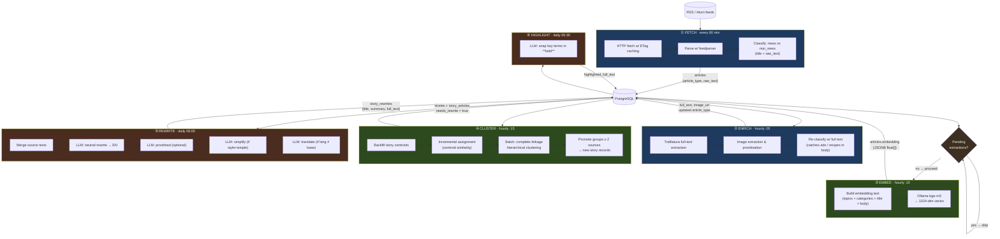
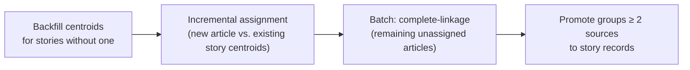
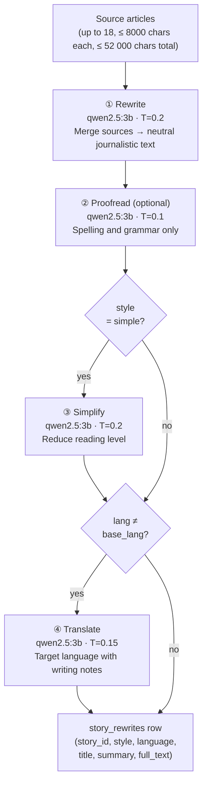

# Pipeline Architecture

The worker runs a six-stage pipeline: RSS feeds in, publication-ready articles out. Each stage is a scheduled job managed by APScheduler. The web container never touches this code — it only reads the final output from the database.

---

## Overview



Non-news articles (`article_type = 'non_news'`) are stored but excluded from every stage after classification. The gate before EMBED/CLUSTER ensures embeddings are computed on enriched text, not stubs.

---

## Stage 1 — FETCH

**Trigger:** `IntervalTrigger(minutes=60)`
**Entry point:** `app/feed/orchestrator.py::fetch_all_due_feeds()`

### What it does

1. Load all active feeds from `sources` / `feeds` tables.
2. For each feed due (`last_fetched_at + poll_interval_minutes`):
   - HTTP GET with `If-None-Match` (ETag) and `If-Modified-Since` headers. A 304 costs nothing.
   - Parse RSS/Atom via `feedparser`.
   - Skip articles older than `max_article_age_hours` (default: 24 h).
   - Deduplicate by `(source_id, url)` with an `INSERT … ON CONFLICT DO NOTHING`.
3. Classify every new article as `news` or `non_news` using keyword heuristics on `title + raw_text` (recipes, horoscopes, classifieds, promotions, sponsored content).
4. Circuit breaker: after 5 consecutive failures on a feed, set `feed_active = false`.

### Inputs → Outputs

| | |
|---|---|
| **Reads** | `sources`, `feeds` |
| **Writes** | `articles` (title, url, source_id, published_at, raw_text, guid, image_url, categories, **article_type**) |
| **Updates** | `feeds.last_fetched_at`, `.etag`, `.last_modified`, `.consecutive_failures` |

### Design notes

- Full text is sometimes included in the RSS feed (open publishers). When present it is stored immediately and the enrich stage skips the HTTP round-trip.
- `article_type = 'non_news'` is permanent unless manually overridden in the ops dashboard. It gates every downstream stage.

---

## Stage 2 — ENRICH

**Trigger:** `CronTrigger('5 * * * *')` — hourly at :05
**Entry point:** `app/extraction/extractor.py::enrich_all_articles()`

### What it does

1. Query all `news` articles where `full_text IS NULL` (or below 200 chars), in batches of 30.
2. For each article, respect a per-domain rate limit (`rate_limit_per_domain = 2.0 req/s`).
3. Call Trafilatura on the article URL to extract main body text and any body/og images.
4. Image selection priority: body image > og:image meta > existing feed thumbnail (feed thumbnails are replaced because they're often low-quality or off-topic).
5. **Re-classify** with full text: an article whose lede looked like news but whose body contains non-news patterns gets `article_type` updated to `'non_news'`.
6. Repeat up to `max_enrichment_rounds = 20` rounds per run.

### Inputs → Outputs

| | |
|---|---|
| **Reads** | `articles` where full_text is missing |
| **Writes** | `articles.full_text`, `.image_url`, `.image_source`, optionally `.article_type` |

### Design notes

- Domain-level rate limiting groups articles by hostname and injects a sleep between requests. Prevents hammering a single publisher.
- Trafilatura is configured to return three values: `(body_text, body_image_url, og_image_url)`. The image selection logic runs on top of those.
- The second classifier pass is the backstop for non-news that only reveals itself in the full article body (e.g. a recipe that starts with a news-looking headline).

---

## Stage 3 — EMBED

**Trigger:** `CronTrigger('15 * * * *')` — hourly at :15 (same job as CLUSTER)
**Entry point:** `app/clustering/service.py::run_cluster_and_embed()` — embedding phase
**Guard:** If any articles are still pending extraction, the entire cluster+embed job is skipped.

### What it does

1. Find all `news` articles with no valid embedding.
2. Build the embedding input string:
   ```
   topics: politics, international
   categories: crisis, diplomacy

   Article title here. First 2000 characters of body…
   ```
   Topic labels come from the source's entry in `sources.yaml` (e.g. a politics-only outlet gets `topics: politics` prepended). This biases the vector space so domain-exclusive sources cluster with topically similar ones rather than drifting toward general-purpose outlets.
3. Call `Ollama bge-m3` → 1024-dimensional float vector.
4. Store as `articles.embedding` (JSONB).

### Inputs → Outputs

| | |
|---|---|
| **Reads** | `articles` (news, no embedding) |
| **Writes** | `articles.embedding` (float[] as JSONB) |

### Key config

| Key | Default | Effect |
|---|---|---|
| `embeddings.model` | `bge-m3` | Ollama model |
| `embeddings.max_input_chars` | 8000 | Truncate before sending |
| `processing.embed_batch_size` | 0 (unlimited) | Cap articles per run |

---

## Stage 4 — CLUSTER

**Trigger:** same job as EMBED, runs immediately after
**Entry point:** `app/clustering/service.py::run_cluster_and_embed()` — clustering phase

### What it does

The clustering phase has three sub-steps:



#### Incremental assignment

For each article that has no story yet, compute cosine similarity against every existing story's centroid. Accept the best match above the threshold, subject to two gates:

- **Source-topic gate:** if both the candidate article's source and the story's sources are domain-exclusive (neither has `"general"` in their topic set) and their topic sets are disjoint → reject. Prevents a sports article from clustering with a politics story just because they share vocabulary.
- **Exclusion rules:** if any (article_a, article_b) pair from the ops dashboard's feedback agent marks these articles as incompatible → reject.

On acceptance, recompute the story centroid (mean of member embeddings) and, if a new source was added, set `needs_rewrite = true`.

#### Complete-linkage hierarchical clustering

Articles not assigned to any existing story are clustered from scratch:

1. Compute the upper-triangle pairwise cosine similarity matrix.
2. Start with each article as its own singleton.
3. Greedily merge the pair of groups with the highest `min_sim` — but only if **every** cross-group pair satisfies:
   - Not blocked by an exclusion rule.
   - Topic-compatible (same gate as above).
   - Similarity ≥ threshold (per-source-pair override if configured, else global default 0.92).
4. Continue until no eligible merge remains.

Complete linkage is deliberately strict. It prevents "chaining" — the failure mode where A groups with B because sim(A,B) > threshold, and B groups with C because sim(B,C) > threshold, but A and C are about different events.

#### Story promotion

Groups with ≥ 2 distinct sources become story records. Single-source groups are left unassigned; they will be reconsidered next hour when a second source may have published.

Articles without embeddings (Ollama was unavailable when they were processed) are treated as permanent singletons and never promoted.

### Inputs → Outputs

| | |
|---|---|
| **Reads** | `articles` (news, with embeddings), `stories`, `story_articles`, `clustering_exclusion_rules` |
| **Writes** | `stories`, `story_articles`, `stories.centroid_embedding`, `stories.needs_rewrite` |

### Key config

| Key | Default | Effect |
|---|---|---|
| `processing.story_similarity_threshold` | 0.92 | Cosine similarity floor |
| `processing.story_min_sources` | 2 | Min distinct sources per story |
| `processing.cluster_window_hours` | 0 (all) | Age cap on articles considered |

---

## Stage 5 — REWRITE

**Trigger:** `CronTrigger('0 6 * * *')` — daily at 06:00
**Entry point:** `app/services/rewrite_service.py::run_rewrite_batch()`

### LLM cascade

One story produces one rewrite variant per `(style, language)` combination configured in `app.yaml`. The cascade:



### Output contract

Every LLM call in this stage must produce exactly three labelled sections (enforced via a prompt prefix injected at runtime):

```
TITLE: …one line…
SUMMARY: …two sentences…
FULL: …full article…
```

The parser strips markdown bold, normalises localised header aliases (`TÍTULO:` → `TITLE:`), and strips any preamble before the first `TITLE:` line. A parse failure sets `rewrite_failed = true` and stores the error; the pipeline continues to the next story.

### Concurrency

A thread pool processes stories in parallel (default `rewrite_parallel_workers = 1`). A single `_OLLAMA_CHAT_LOCK` serialises all actual LLM calls — two concurrent large-context requests would exceed RAM on the NAS's CPU-only Ollama.

### Inputs → Outputs

| | |
|---|---|
| **Reads** | `stories` where `needs_rewrite = true`, `story_articles`, `articles` |
| **Writes** | `story_rewrites` (story_id, style, language, title, summary, full_text, rewrite_failed) |
| **Updates** | `stories.needs_rewrite = false` on success |

### Key config

| Key | Default | Effect |
|---|---|---|
| `llm.rewrite_model` | `qwen2.5:3b` | The only model pulled on the NAS — sized for CPU inference |
| `llm.simplify_model` | `qwen2.5:3b` | Falls back to `rewrite_model`; not activated in the current Catalan-only config |
| `llm.translate_model` | `qwen2.5:3b` | Falls back to `rewrite_model`; not activated (single-language digest) |
| `processing.rewrite_proofread_enabled` | `true` | Toggle the proofread pass |
| `rewriting.base_language` | `ca` | Language of the initial rewrite — Catalan only, no translation step |

---

## Stage 6 — HIGHLIGHT

**Trigger:** `CronTrigger('30 6 * * *')` — daily at 06:30
**Entry point:** `app/services/highlight_service.py::run_highlight_batch()`

A lightweight LLM pass over each `story_rewrites.full_text`. The model wraps significant terms and named entities in `**bold**`. The web UI renders these as visual emphasis without a separate search index or NER pipeline.

Runs after REWRITE so it always operates on the final translated/simplified output.

### Inputs → Outputs

| | |
|---|---|
| **Reads** | `story_rewrites` where `highlighted_full_text IS NULL` |
| **Writes** | `story_rewrites.highlighted_full_text` |

---

## Schema Reference

| Table | Key columns | Role |
|---|---|---|
| `articles` | id, source_id, title, url, raw_text, full_text, image_url, image_source, article_type, **embedding** (JSONB), published_at | One row per RSS item. `embedding` stores the 1024-dim vector. |
| `stories` | id (UUID), **centroid_embedding** (JSONB), **needs_rewrite** (bool), created_at | Groups ≥ 2 articles from different sources about the same event. |
| `story_articles` | story_id, article_id, position | Many-to-many membership table. |
| `story_rewrites` | story_id, style, language, title, summary, full_text, highlighted_full_text, rewrite_failed, error_message | One row per `(story, style, language)` variant. The web layer reads from here. |
| `clustering_exclusion_rules` | rule_type (`article_pair` / `source_pair`), rule_data (JSONB), active | Operator-managed rules that prevent specific articles or source pairs from clustering together. Created by the ops dashboard's feedback agent. |
| `job_runs` | id, job_name, trigger, status, result (JSONB), log_file, created_at | Audit trail for every scheduled or manual pipeline run. |
| `feeds` | source_id, feed_url, poll_interval_minutes, last_fetched_at, etag, last_modified, consecutive_failures, feed_active | Per-feed RSS state. `consecutive_failures` drives the circuit breaker. |

---

## Scheduler & Deployment

The worker runs every pipeline job on a single schedule — there is no machine-split mode.
The single deployment target is the NAS (`docker-compose.yml`, CPU-only Ollama).

### Default schedule

```
:00  FETCH runs (interval, every 60 min)
:05  ENRICH runs
:15  EMBED + CLUSTER run (skipped if enrichment still pending)
06:00  REWRITE runs (daily)
06:30  HIGHLIGHT runs (daily)
```

### Manual CLI

```bash
python -m app.worker_cli fetch-feeds
python -m app.worker_cli enrich-articles
python -m app.worker_cli cluster-articles
python -m app.worker_cli rewrite-articles
python -m app.worker_cli highlight-stories
python -m app.worker_cli run-pipeline   # full sequential run for testing
```

Each run is logged to `job_runs` in PostgreSQL and to a per-run `.log` file under `data/job_runs/`. Both are visible in the ops dashboard at `http://localhost:5001`.
